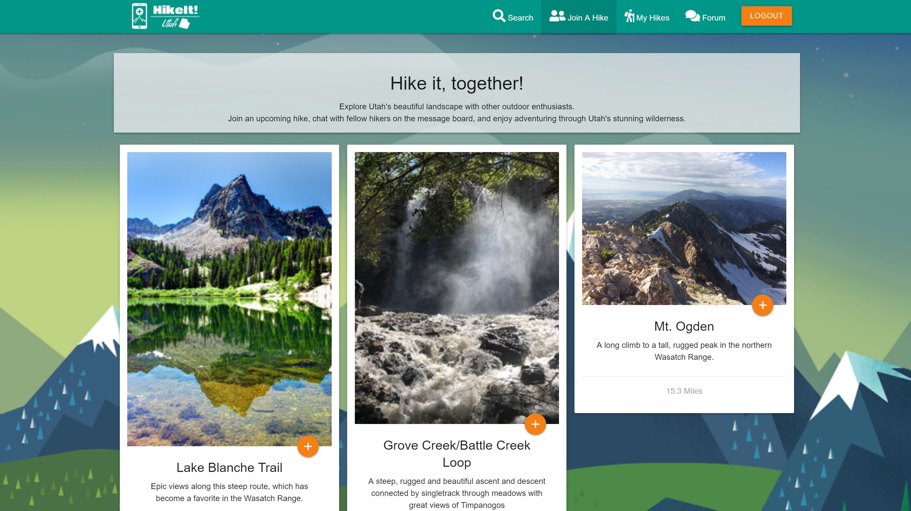

# HikeIt! 
##- a social exploration of Utah's Hiking Trails
Finding a hike can be difficult if you don't know where to look or who to ask. Because Utah has so many trails its easy to get lost on where you wanna go. Users can search by city and find hikes in their immediate vicinity. Users can even join hikes that have been created by other registered users.

## Using the App
Users can create an account by registering with a password and email address. From the main page users can search hikes that others have already found and created an event for. 

### Join, Search, or Manage your Hikes
On the Search page, users can search locations in Utah, these searches auto-complete to specific cities in Utah. From there, when users click search, all hikes within that area are populated.

### Chat
Chat with the community on our chat page and plan your next adventure!

### Logging Out
Users may log out anytime, with sessions if a user does not log out, they will be relogged in upon visiting the site again.

###deployed at:
https://dansirdan.github.io/hike-it/

### Development Team:

Jessica Bramwell
Hayder Achir
Brandon Conover
& Dan Mont-Eton

### Technologies Used
- Firebase Data & Authentication
- HTML
- Geolocation API
- The Hiking Project API (sponsored by REI)
- Font Awesome
- Materialize

## Photos

#### Login Page

#### Join a Hike

#### Search

